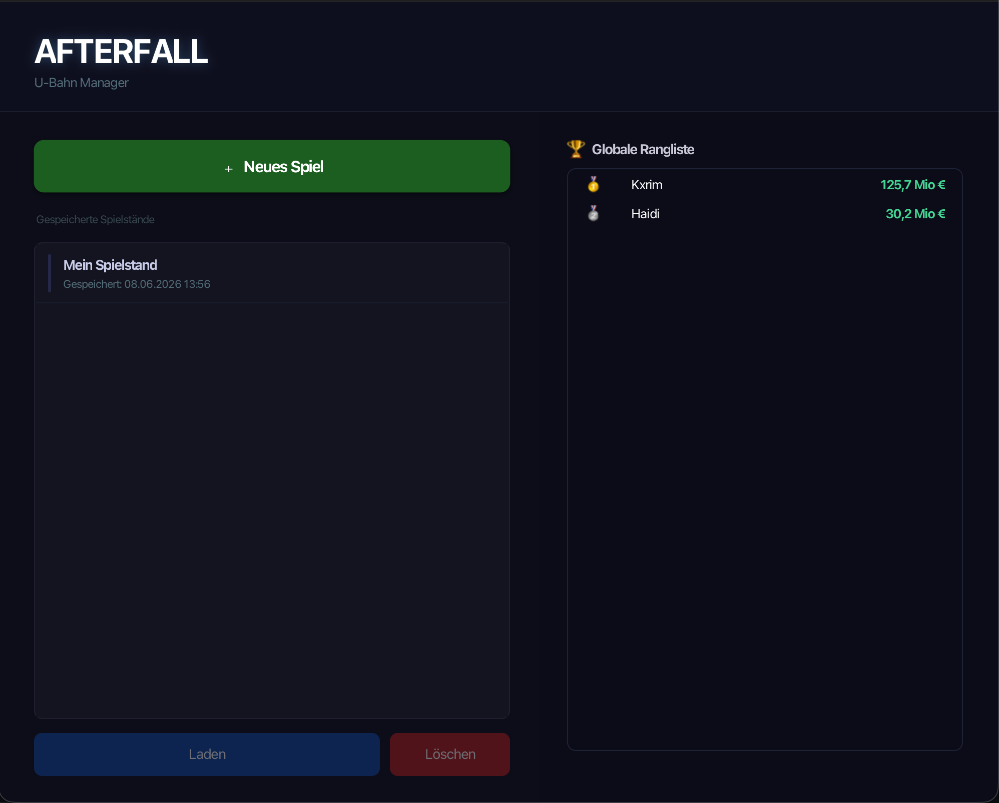
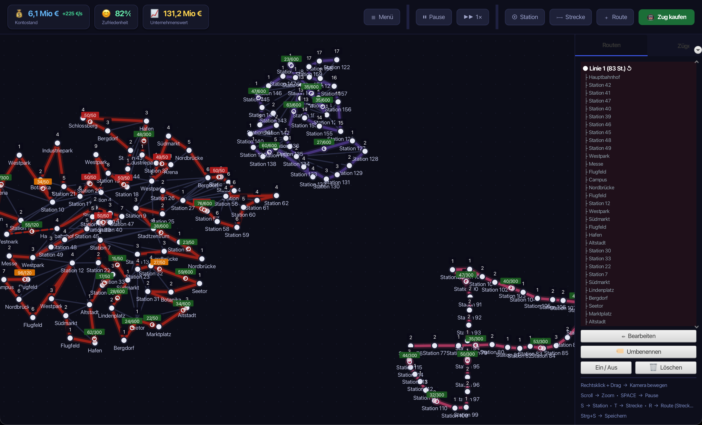

# Afterfall

Pausable U-Bahn management game. Build a metro network, connect stations, run trains, grow your city.

**Team:** Kerimcan Yagci · Nico Haider · Fridolino Dürk

---

## Screenshots

### Lobby


### Game


---

## Features

- Build stations & tracks, create routes with automatic line colors
- 3 train types (Standard / Medium / Super) with different speed & capacity
- City grows over time — new stations demand connection or satisfaction drops
- Ticket pricing, satisfaction system, online ranking by net worth
- Server-authoritative: all simulation runs on backend, client is pure renderer

## Run

```bash
mvn -f protocol/pom.xml install
mvn -f backend/pom.xml spring-boot:run    # Port 8080 (REST) + 9090 (TCP)
mvn -f frontend/pom.xml javafx:run
```
